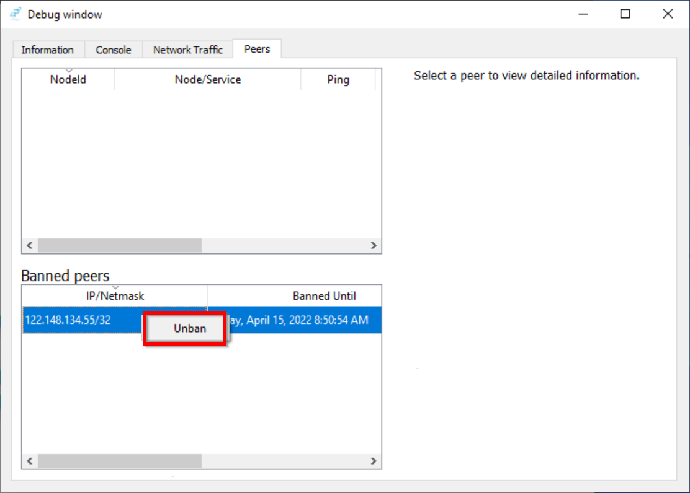

# Windows GUI Wallet Troubleshooting Guide

Below are some of the most common troubleshooting steps you may be asked to do if you're having issues with your wallet. The two most important are knowing how to [Back Up Your Wallet](#back-up-your-wallet) and how to [Restore Your Wallet](#restore-your-wallet) so you don't lose access to your funds.

## Back Up Your Wallet

**NOTE**: It's recommended that you encrypt your wallet. Unencrypted wallet files can be opened by anyone or anything with access to your system or backup media. See the [Windows GUI Wallet Setup guide](WindowsGUI-WalletSetup.md) for instructions, then continue here once it's encrypted.

1. In the Pulsar wallet go to File > Backup wallet...

    

2. Choose a location to save your backup file.

    

3. You should see a notification confirming that your wallet was backed up.

    

**NOTE**: It's best practice to keep multiple copies of your backup file on secure, removeable storage to ensure you do not lose access to your PLSR as a result of hard disk failure.

## Clear All Pulsar Data

**NOTE**: If you installed the Pulsar Wallet using the setup.exe with default settings, your Pulsar data should be in `%AppData%\Pulsar`. If you used `pulsar-qt.exe` or installed with custom settings your wallet and blockchain data may be in a different location.

1. Quit the Pulsar wallet app if it's running. 

2. Click the Windows Start, type `%AppData%\Pulsar`, and hit Enter.

    

3. You should see Pulsar config files and a few folders.

    

4. Select all files/folders and delete them.

    

5. Launch the Pulsar wallet app to start syncing blockchain data again.

## Restore Your Wallet

1. Quit the Pulsar wallet app if it's running.

2. Click the Windows Start, type `%AppData%\Pulsar`, and hit Enter.

    

3. You should see Pulsar config files and a few folders. (If not, start the Pulsar wallet app and let it sync the blockchain, then quit, and check again.). Double-click the `wallets` folder.

    

4. Drag your backup wallet file to the `wallets` folder (hold `Ctrl` to make a copy instead of moving the original).

    

5. Delete `wallet.dat` and then rename your backup file to `wallet.dat`.

    

    

6. Start the Pulsar wallet app again and you should see your old wallet balance and addresses.

## Wallet Not Syncing

If your wallet is not syncing the most common reasons are [no peers](#no-active-peer-connections), or a problem with the [cached blockchain data](#problem-with-cached-data).

### No Active Peer Connections

1. If your wallet doesn't have any peer connections it will not be able to sync. This shuld be indicated at the bottom of the wallet window with (1) "Connecting to peers..." and (2) a grey connection icon.

    

2. You can verify this and check for banned peers in the Peers tab of the Debug window. Go to the Help menu and click "Debug window..."

    

3. Click the Peers tab. Active peers will be listed in the top section, banned peers in the bottom.

    

4. Start by unbanning any banned peers. Right-click on each banned peer and click "Unban".

    

5. You should soon see active peers.

    

6. To maximize the number of potential peers in the future, you should add a list of peers to your `pulsar.conf` file. Go to the Settings menu and click "Options...".

    

7. Click "Open Configuration File" near the bottom to open `pulsar.conf`. Click OK to acknowledge the info about the config file.

    

    

8. Replace all the lines below `# ADDNODES:` with the following list:
    ```
    addnode=2.92.134.10:5995
    addnode=5.135.136.12:5995
    addnode=14.18.42.138:5995
    addnode=39.164.244.3:5995
    addnode=42.192.134.125:5995
    addnode=49.232.0.153:5995
    addnode=62.122.201.178:5995
    addnode=65.186.33.100:5995
    addnode=71.89.244.72:5995
    addnode=85.230.140.213:5995
    addnode=91.243.0.112:5995
    addnode=94.130.34.225:5995
    addnode=95.129.58.28:5995
    addnode=95.165.169.188:5995
    addnode=103.249.70.51:5995
    addnode=109.167.134.30:5995
    addnode=149.28.244.210:5995
    addnode=176.215.69.198:5995
    addnode=192.3.152.135:5995
    addnode=192.46.215.125:5995
    addnode=45.63.65.34:5995
    addnode=137.220.60.11:5995
    ```

    **NOTE**: At this time you may also want to add the following line just above `# ADDNODES:` to prevent peers from being banned to quickly:
    ```
    banscore=10000
    ```

9. Your `pulsar.conf` should now look like this:

    

10. Save your changes to `pulsar.conf`, quit the Pulsar wallet app, and then run the Pulsar wallet app again.

    

    

11. It may take several minutes for new peer connections to become active after restarting the wallet app. Once you have at least 1 active peer connection the wallet should begin/resume syncing.

### Problem With Cached Data

Less commonly there may be an issue with the cached blockchain data or wallet itself. If you've already ruled out a [peer connection issue](#no-active-peer-connections) above, perform the following (in order) to safely clear all cached data.

1. [Back Up Your Wallet](#back-up-your-wallet)

2. [Clear All Pulsar Data](#clear-all-pulsar-data)

3. [Restore Your Wallet](#restore-your-wallet)