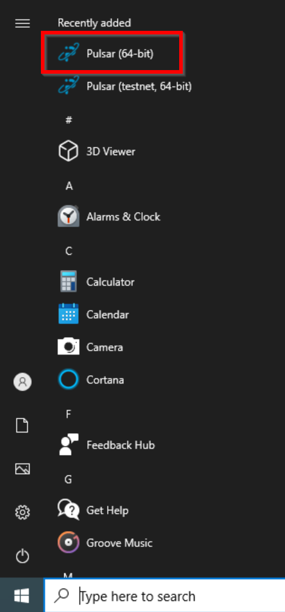

# Windows GUI Wallet Setup

 1. Download the latest Pulsar Windows release (1.1.1 in this example) and extract.

 2. Double-click `pulsar-1.1.1-win64-setup.exe` to begin setup.

    

 3. If prompted by Windows Defender, click "More Info" at the top left and then click "Run anyway" at the bottom.

     

 4. Click Next, then Next to accept the default install directory, then Install.

     

     

     

 5. Once installation has completed, click Next and then Finish.

     

     

 6. If prompted, click "Allow access" to allow `pulsar-qt.exe` to make network connections.

     

 7. After the Pulsar splash screen you should see the main Pulsar wallet window indicating that the wallet is currently syncing the blockchain.
 
    **NOTE**: This process normally takes less than an hour but may take longer depending on your network speed and other factors. If syncing appears to be stuck or does not start, see the [Troubleshooting Guide](WindowsGUI-Troubleshooting).

    

 8. Once the wallet has finished syncing your wallet should look like this:

    

 9. For security the first thing you should do is encrypt your wallet. Go to the Settings menu, then choose "Encrypt Wallet...".

    

 10. Enter a secure password to encrypt your wallet, then click OK. 

     

     **NOTE**: Be sure to keep your wallet password in a safe place. As the warning says, you will lose access to your PLSR if you forget it.

     

 11. When the wallet has been encrypted a mesage will appear, click OK to close the wallet.

     

 12. Click the Windows Start menu and run the Pulsar wallet again.

     

 13. When the wallet opens you will see a new message near the top (`"Info: Staking suspended due to locked wallet."`) as well as a lock icon at the bottom right. These confirm that your wallet is now encrypted and locked.

     

 14. To unlock your wallet, go to the Settings menu and click "Unlock Wallet...".

     

 15. Enter your wallet password and click OK to unlock your wallet for staking and transactions.

     

 16. The message about a locked wallet should now be gone and the lock icon at the bottom right changed to an unlocked icon.

     

 17. To create a new receiving address go to the File menu and click "Receiving addresses...".

     

 18. Click the New button at the bottom left, enter a label for your new address, then click OK.

     

     

 19. Your new receiving address should now be listed.

     

 20. You now have a working and secured Pulsar wallet!

 **NOTE**: It's **critical** to keep a backup of your `wallet.dat` file! This file contains your private keys and without them you will lose acess to any PLSR stored in your wallet. See the [Backup Guide](WindowsGUI-Troubleshooting.md#back-up-your-wallet) for instructions.